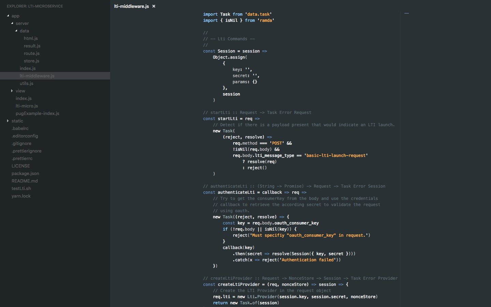

# Minimal Fedu

Opionated theme that brings the simplicity and focus of the **Fedu** syntax theme to the editor. It's based on [Fedu](https://marketplace.visualstudio.com/items?itemName=Mustanaamio.theme-fedu) color theme, which is itself based on the [Eclipse theme](http://www.eclipsecolorthemes.org/?view=theme&id=30389).



## Disclaimer

This theme should remove visual distraction and to archieve this it works with low contrast in some parts. I'm just sharing what works for me to make VS Code more minimal in design and remove visual clutter. I'm happily incorporate changes that respect that intention and fix rough edges.

I'm didn't test the syntax coloring with much languages (JavaScript, HTML, Css, Markdown and Elm) and happily incoporate fixes that fix other languages.

## Configuration

This isn't just a theme for me, it's an attempt to trim down VS Code for a more minimal coding experience. In this sense I suggest you to add these to your settings, for the intended effect:

```js
    // -- Remove visual fuzz --
    "editor.folding": false,
    "editor.lineNumbers": "off",
    "editor.minimap.enabled": false,
    "editor.minimap.renderCharacters": false,
    "workbench.editor.showIcons": false,
    "workbench.iconTheme": null,
    "explorer.openEditors.visible": 0,
    "workbench.statusBar.visible": false, // disable the StatusBar at the bottom
    "workbench.statusBar.feedback.visible": false,
    "workbench.activityBar.visible": false, // disable activitybar on left side
```

This will disable the status bar and the activity bar. Memoize the shortcuts instead:

*   <kbd>shift</kbd> + <kbd>command</kbd> + <kbd>E</kbd> for Explorer.
*   <kbd>shift</kbd> + <kbd>ctrl</kbd> + <kbd>G</kbd> for Git.
*   <kbd>shift</kbd> + <kbd>command</kbd> + <kbd>D</kbd> for Debugger.
*   <kbd>command</kbd> + <kbd>B</kbd> to show and hide the left pane

Also, there are some interruptions during coding in the editor, which I recommend to disable:

```js
    "editor.acceptSuggestionOnEnter": "off",
    "editor.quickSuggestions": {
        "other": false,
        "comments": false,
        "strings": false
    },
    "editor.parameterHints": false,
```

## Going a Step Further

If you don’t mind potentially breaking your VS Code setup beyond the point of recovery, I recommend trying [Custom CSS](https://marketplace.visualstudio.com/items?itemName=be5invis.vscode-custom-css) extension with the following custom CSS:

```css
.title-actions
    > .monaco-toolbar
    > .monaco-action-bar
    > .actions-container
    > .action-item
    > .action-label.icon.explorer-action {
    display: none !important;
}
.editor-actions > .monaco-toolbar > .monaco-action-bar {
    display: none !important;
}
```

This will remove the icon buttons on panels.

You may notice VS Code isn’t very happy about you overriding its CSS and shows you a warning. Just disable it from showing again.

Don’t say I didn’t warn you everything might break.

## Credits

Based on [Fedu](https://marketplace.visualstudio.com/items?itemName=Mustanaamio.theme-fedu) and took the **Going a Step Further** chapter from [Subliminal](https://github.com/gaearon/subliminal/blob/master/README.md)

## License

MIT
